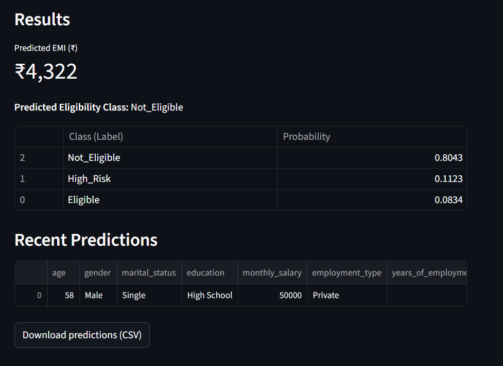

# 🧠 EMIPredict AI – Intelligent Financial Risk Assessment Platform

### 🚀 FinTech | Machine Learning | MLflow | Streamlit Cloud

<p align="center">
  
</p>

**EMIPredict AI** is a comprehensive **Financial Risk Assessment Platform** built using advanced **Machine Learning models**, **MLflow tracking**, and a **Streamlit web interface**.
The system predicts **EMI Eligibility (Classification)** and **Maximum EMI Amount (Regression)** based on customer financial profiles, enabling data-driven loan decision-making.

---

## 📌 Problem Statement

In today’s digital lending environment, individuals often struggle with EMI planning and risk evaluation due to lack of accurate financial assessment tools.
**EMIPredict AI** addresses this by building an end-to-end **AI-powered financial risk prediction platform** that can analyze 400,000 financial records and provide instant eligibility and EMI recommendations.

---

## 🎯 Project Objectives

✅ Build dual ML solutions:

* **Classification** → EMI eligibility prediction
* **Regression** → Maximum EMI amount estimation

✅ Perform feature engineering on 22 financial and demographic variables.
✅ Integrate **MLflow** for model tracking and performance comparison.
✅ Develop a **Streamlit-based web app** for real-time prediction and visualization.
✅ Deploy the complete project to **Streamlit Cloud** for public access.

---

## 🏗️ Architecture Overview

```
Dataset (400K Records)
        ↓
Data Cleaning & Preprocessing
        ↓
Feature Engineering & EDA
        ↓
Model Training & MLflow Tracking
        ↓
Model Evaluation & Selection
        ↓
Streamlit Application Development
        ↓
Cloud Deployment (Streamlit Cloud)
```

---

## 🧩 Dataset Details

**Dataset Name:** `emi_prediction_dataset`
**Total Records:** 400,000
**Input Features:** 22 variables
**Target Variables:**

* `emi_eligibility` (Eligible / High_Risk / Not_Eligible)
* `max_monthly_emi` (Continuous value in INR)

### Feature Categories

| Category              | Example Features                                           |
| --------------------- | ---------------------------------------------------------- |
| Personal Demographics | age, gender, marital_status, education                     |
| Employment & Income   | monthly_salary, employment_type, years_of_employment       |
| Housing & Family      | house_type, monthly_rent, family_size, dependents          |
| Financial Obligations | school_fees, groceries_utilities, other_monthly_expenses   |
| Credit & Savings      | existing_loans, credit_score, bank_balance, emergency_fund |
| Loan Details          | emi_scenario, requested_amount, requested_tenure           |

---

## 🧠 Machine Learning Approach

### 🔹 Classification (EMI Eligibility)

Models used:

* Logistic Regression
* Random Forest Classifier
* XGBoost Classifier
  (Additional: SVC, Decision Tree, Gradient Boosting)

**Metrics:** Accuracy, Precision, Recall, F1-score, ROC-AUC

### 🔹 Regression (Maximum EMI Amount)

Models used:

* Linear Regression
* Random Forest Regressor
* XGBoost Regressor
  (Additional: SVR, Decision Tree Regressor, Gradient Boosting)

**Metrics:** RMSE, MAE, R², MAPE

### 🔹 MLflow Integration

* Tracks model parameters, metrics, and artifacts.
* Provides experiment dashboard for model comparison.
* Implements model registry for version control.

---

## 🖥️ Streamlit Application

A multi-page interactive web application with:

* Real-time EMI eligibility and EMI amount prediction.
* Dynamic data visualization and exploration.
* Integrated MLflow dashboard for model performance tracking.
* Clean UI with user-friendly design.

---

## ☁️ Deployment

* Deployed on **Streamlit Cloud** with GitHub CI/CD integration.
* Supports responsive design for web and mobile devices.
* Publicly accessible and production-ready.

---

## 📊 Expected Results

| Task                    | Goal                                      |
| ----------------------- | ----------------------------------------- |
| Classification Accuracy | ≥ 90%                                     |
| Regression RMSE         | ≤ 2000 INR                                |
| Data Volume             | 400,000 financial records                 |
| Processing Efficiency   | 80% reduction in manual underwriting time |

---

## 💼 Business Use Cases

**🏦 Financial Institutions**

* Automate loan approvals and reduce underwriting time.
* Enable risk-based pricing for EMI products.

**💳 FinTech Companies**

* Integrate real-time eligibility checks in digital lending platforms.
* Offer pre-qualification services in mobile apps.

**🏢 Banks & Credit Agencies**

* Provide data-backed loan amount recommendations.
* Improve portfolio risk management and regulatory compliance.

**👩‍💼 Loan Officers & Underwriters**

* Get AI-powered insights for faster and fairer loan decisions.

---

## 🧮 Tech Stack

| Category        | Tools / Technologies                               |
| --------------- | -------------------------------------------------- |
| Programming     | Python                                             |
| Libraries       | Pandas, NumPy, Scikit-learn, XGBoost, RandomForest |
| Visualization   | Matplotlib, Seaborn                                |
| ML Tracking     | MLflow                                             |
| Web Framework   | Streamlit                                          |
| Deployment      | Streamlit Cloud                                    |
| Version Control | Git, GitHub                                        |

---

## 📂 Repository Structure

```
EMIPredict-AI---Intelligent-Financial-Risk-Assessment-Platform-ML-Project/
│
├── app/                      # Streamlit app folder
├── EDA and ML Part.ipynb     # Notebook for EDA and ML model development
├── emi_prediction_dataset.zip # Dataset (400K records)
├── requirements.txt          # Required Python dependencies
├── Project Title.pdf         # Project report and details
├── Demo.png                  # Project demo screenshot
└── README.md                 # Project documentation
```

---

## ⚙️ Installation & Usage

1. **Clone the repository**

   ```bash
   git clone https://github.com/mangal-singh001/EMIPredict-AI---Intelligent-Financial-Risk-Assessment-Platform-ML-Project.git
   cd EMIPredict-AI---Intelligent-Financial-Risk-Assessment-Platform-ML-Project
   ```

2. **Install dependencies**

   ```bash
   pip install -r requirements.txt
   ```

3. **Run the Streamlit app**

   ```bash
   streamlit run app/app.py
   ```

4. **Access the MLflow dashboard** (if configured)

   ```bash
   mlflow ui
   ```

---

## 📈 Key Achievements

* Processed **400K+ financial records** efficiently.
* Achieved **>90% classification accuracy** and **<2000 INR RMSE** in regression.
* Implemented **MLflow tracking and model registry** for version control.
* Developed and deployed a **real-time, production-ready Streamlit app**.

---

## 🧾 Deliverables

* Data preprocessing and feature engineering scripts
* EDA report and insights
* Trained ML models for classification & regression
* MLflow tracking logs and model registry
* Streamlit app with live predictions
* Deployment on Streamlit Cloud

---

## 🏁 Conclusion

**EMIPredict AI** delivers an end-to-end, scalable, and intelligent solution for **financial risk assessment and EMI prediction**.
It bridges the gap between data science and real-world financial decision-making, empowering institutions to make informed, faster, and fairer lending decisions.

---

## 🔗 Links

* 📘 **GitHub Repository:** [EMIPredict AI Project](https://github.com/mangal-singh001/EMIPredict-AI---Intelligent-Financial-Risk-Assessment-Platform-ML-Project)
* 📄 **Project Report:** [`Project Title.pdf`](./Project%20Title.pdf)
* 🎥 **Demo Video:** *(to be added after upload)*
* ☁️ **Live Streamlit App:** *(to be added after deployment)**

